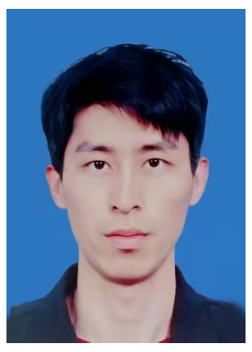

{:refdef:style="text-align: center;"}

{:refdef}

# 基本信息

| 姓名        	|薛雄铠   |
| :------------   | :------------  |
| **出生年月**     | 1995/8/4   |
| **开发经验**     | 2年  |
| **联系方式**         |    13600095769    |
| **求职意向**         |    Unity游戏开发   |
| **邮箱**         |    woshinixxk@163.com |
| **学历**         |    本科    |

# 工作经历

### 2020.4-2020.6
### 广州扬海科技有限公司 WEB前端实习

* 负责公司产品App子页面构建。
* 客户端UI效果实现，根据业务需求完成对应模块功能。

# 项目经验

### 2019.11-至今 
### 独立游戏《白马非马》Unity游戏开发

项目描述：

* 项目使用 **Unity** + **Tiled** 工作流的方式进行开发。
* 项目基于 **Window** 平台，EA版本于2021年11月在steam发行。
* 项目是一款**修仙养成**单机游戏，2D像素风，主要面向国内喜欢修仙题材的群体。

项目责任：
* 负责项目**框架设计**和**美术原型设计**。
* 负责项目**功能模块**开发，并利用 **git** 进行版本控制。
* 负责项目**数值策划**，并应用到项目中，使得数值趋于稳定。
* 负责项目**资源管理**，并利用**Addressable**进行管理

# 教育经历

### 2018.9-2020.6 中山大学南方学院 计算机科学与计算
主/选修课程：
数据结构与算法、线性代数、离散数学、云计算、计算机网络、区块链、小程序开发等

# 自我评价
有较强的**自我管理**和**学习能力**，闲暇之余，会自我学习充电，保持一种学习态度，与时俱进。平时话少，但沟通无障碍，团队合作也没问题。

